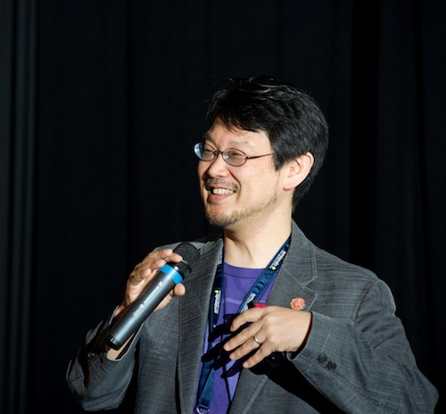

!SLIDE subsection

# What is Ruby? #

!SLIDE center

!SLIDE center

Yukihiro "Matz" Matsumoto

!SLIDE

Ruby is designed for **programmer happiness**.

!SLIDE incremental

# Key Points #

* Dynamic
* Interpreted
* Object-Oriented (Everything* is an object)
* Reflective
* With a dash of functional programming

\* except keywords

!SLIDE

    @@@ruby
    (1..10).select { |number| number.even? }